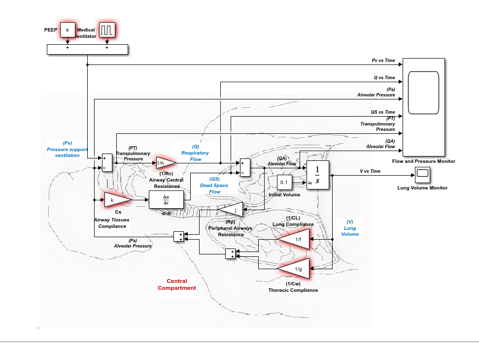

# 🫁 Respiratory Mechanics Simulation Analysis

This repository contains an analysis of respiratory mechanics using a simulation tool developed by **David Leonardo Rodriguez Sarmiento** and **Daniela Acevedo Guerrero (2020)**. The tool enables users to study various adult respiratory conditions such as **normal**, **restrictive**, and **obstructive pulmonary diseases**. The simulator visualizes ventilation patterns and supports the comparison of **minute ventilation** under different physiological and pathological settings.

---

## 📖 Introduction

This analysis aims to explore how different respiratory pathologies affect mechanical ventilation. By simulating normal lung function and disease states (restrictive and obstructive), we examine variations in:

- **Lung compliance and resistance**
- **Tidal volume and minute ventilation**
- **Ventilation pattern visualizations**

These insights help deepen our understanding of how respiratory mechanics change across clinical conditions — an important step toward effective ventilator management in healthcare.

---

## 🧰 Simulation Tool

  

The simulation is conducted using a **GUI-based Simulink application**:

- **Developed by**: David Leonardo Rodriguez Sarmiento and Daniela Acevedo Guerrero
- **Platform**: MATLAB Simulink with GUI integration
- **Functionality**: 
  - Simulates lung behavior under normal, restrictive, and obstructive conditions
  - Provides graphical plots of respiratory parameters (pressure, flow, volume)
  - Allows adjustment of compliance, resistance, and ventilator settings

🖱️ **Tool Available Here**:  
[Simulation of Respiratory Mechanics on Simulink with GUI – MathWorks File Exchange](https://www.mathworks.com/matlabcentral/fileexchange/75335-simulation-of-respiratory-mechanics-on-simulink-with-gui)

---

## 📊 Simulation Scenarios & Results

### 🔵 Normal Simulation

  
  
  

---

### 🟠 Obstructive Lung Disease Simulation

  
  
  

---

### 🔴 Restrictive Lung Disease Simulation

  
  
  
  

### ✅ Observations:
- **Restrictive disease**: Decreased lung compliance → lower tidal volume → reduced minute ventilation.
- **Obstructive disease**: Increased resistance → limited airflow during inspiration → air trapping → lower effective ventilation.

All simulation outputs including **graphs and screenshots** are stored in the `/simulation results` folder.

---

## 🙏 Acknowledgments

Special thanks to **David Leonardo Rodriguez Sarmiento** and **Daniela Acevedo Guerrero** for developing the Simulink simulation tool used in this analysis. Their contribution to respiratory education through MATLAB tools is highly appreciated.

Original Tool:  
[Simulation of Respiratory Mechanics on Simulink with GUI](https://www.mathworks.com/matlabcentral/fileexchange/75335-simulation-of-respiratory-mechanics-on-simulink-with-gui)

---

